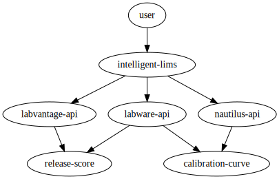

# intelligent-lims microservice

The purpose of this microservice is to handle the 'lims' attribute accordingly,
forwarding the package to the lv-handler for further evalutation.

<center>



</center>

## LIMS

To modify/add mappings for LIMS, enter the container and modify:

```
# LIMS to URL mapping
lims_to_url = {
    "labvantage": "https://some-kubernetes-cluster-service/lv-handler",
}
```

## Payload
```
{
	"lims": "labvantage",
	...
}

```
$(Invoke-WebRequest -Method Post -ContentType "application/json" -Body '{"lims": "labvantage", "action": "lookupTransaction", "shouldReport": true, "content": {"transaction_id": "9a33ac88-2f97-4872-a6cc-2dbf9c28e2d5"}}' -Uri http://localhost:5001/intelligent-lims -UseBasicParsing).Content
```

```
$(Invoke-WebRequest -Method Post -ContentType "application/json" -Body '{"lims": "labvantage", "action": "getScore", "shouldReport": true, "content": {"sdcid": "Batch", "labels": ["sdclabel184", "sdclabel284", "sdclabel281"], "data": [[44, 28, 1838, 4082], [10, 221, 213, 22], [249, 2928, 82, 18171]]}}' -Uri http://localhost:5004/intelligent-lims -UseBasicParsing).Content
```

```
$(Invoke-WebRequest -Method Post -ContentType "application/json" -Body '{"lims": "labvantage", "action": "lookupTransaction", "shouldReport": true, "content": {"transaction_id": "ab90a2af-b948-4725-9422-fca237f2f30d"}}' -Uri http://localhost:5001/intelligent-lims -UseBasicParsing).Content
```

```
$response = Invoke-WebRequest -Method Post -ContentType "application/json" -Body '{"lims": "labvantage", "action": "getScore", "shouldReport": true, "content": {"sdcid": "Batch", "labels": ["sdclabel11384", "sdclabel23084", "sdclabel29481"], "data": [[20948, 28, 1838, 4082], [422, 2434, 21, 144], [249, 2928, 82, 18171]]}}' -Uri http://3.214.69.84:5004/intelligent-lims -UseBasicParsing
$response.Content
```

```
$response = Invoke-WebRequest -Method Post -ContentType "application/json" -Body '{"lims": "labvantage", "action": "lookupTransaction", "shouldReport": true, "content": {"transaction_id": "59fada2f-958a-4313-8337-e0222e5eedab"}}' -Uri http://3.214.69.84:5004/intelligent-lims -UseBasicParsing
$response.Content
```

curl -X POST -H "Content-Type: application/json" -d '{"lims": "labvantage", "action": "lookupTransaction", "shouldReport": true, "content": {"transaction_id": "59fada2f-958a-4313-8337-e0222e5eedab"}}' http://3.214.69.84:5004/intelligent-lims

Rules:

- Always use Python for our true backend services (like the genie
  microservices). Reasoning: It is easy to get lost in the sauce, because of
  this java should only be used for front end, and python should be used for
  backend.

- Always use toml configuration files. json should be used specifically within
  the code itself, but all external configuration should be done via toml
  Reasoning: json is messy, toml is easier to modify, and json is more
  specifically for web transactions.

- We use python because of its easy support of virtual environments and its
  ubiquity

- all variables in snake_case, all classes in PascalCase, and all functions in
  camelCase. Constants in ALL_CAPS.

- abstract classes in python will end with ABC, for abstract base class, e.g.
  AutomobileABC.

- all functions should have full definitions, that is, their definition
  attributes should include the relevant types, and returns should be typed
  as well.

- All functions that elicit an exception should document as such with a
  docquote, e.g. """Raises: ExceptionThatCouldHappen"""
```

